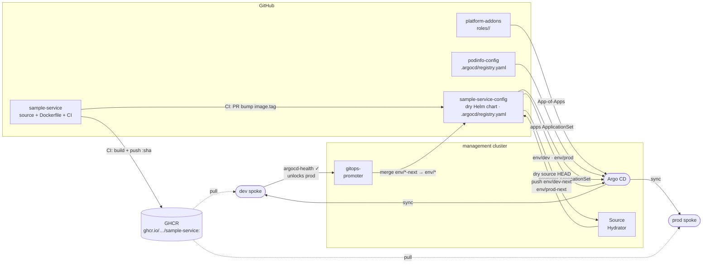

# CLAUDE.md

This file provides guidance to Claude Code (claude.ai/code) when working with code in this repository.

## Delivery pipeline



## Architecture

`platform-apps` now owns **routes only**. App registration has moved to each app's own config repo via `.argocd/registry.yaml`.

### `routes/` — HTTPRoutes (`app-routes` ApplicationSet)

Git directory generator over `routes/<app>/<env>/`. Each directory contains an Envoy Gateway `HTTPRoute` manifest. The `app-routes` ApplicationSet generates one Argo CD Application per (app × env), syncing the HTTPRoute to the appropriate spoke. Adding a new route requires no bootstrap changes — just create the directory and push.

### App registration (not in this repo)

Each app config repo carries `.argocd/registry.yaml`. The `apps` and `promoter` ApplicationSets in `platform-control-plane/scripts/bootstrap.sh` read these files via static per-repo git generators (`HELM_APP_REPOS` / `PROMOTER_APP_REPOS` arrays).

**Helm app schema** (`apps` ApplicationSet):
```yaml
name: <service>
repoUrl: <helm chart registry URL>
chart: <chart-name>
chartVersion: <semver>
namespace: <target-namespace>
valuesRepoURL: https://github.com/platform-engineer-lab/<service>-config
environment:
  - env: dev
    defaultValuesFile: values/default-values.yaml
    valuesFile: values/dev-values.yaml
  - env: prod
    defaultValuesFile: values/default-values.yaml
    valuesFile: values/prod-values.yaml
```

**Promoter app schema** (`promoter` ApplicationSet):
```yaml
name: <service>
repoUrl: https://github.com/platform-engineer-lab/<service>-config
configPath: config
```

## Key conventions

- **Never use `destination.server`** — always `destination.name` (`dev` or `prod`).
- **Adding a route**: create `routes/<app>/<env>/httproute.yaml` — `app-routes` discovers it automatically.
- **Adding an app**: create the app's config repo with `.argocd/registry.yaml`, then add the repo URL to `HELM_APP_REPOS` or `PROMOTER_APP_REPOS` in `platform-control-plane/scripts/bootstrap.sh`.
