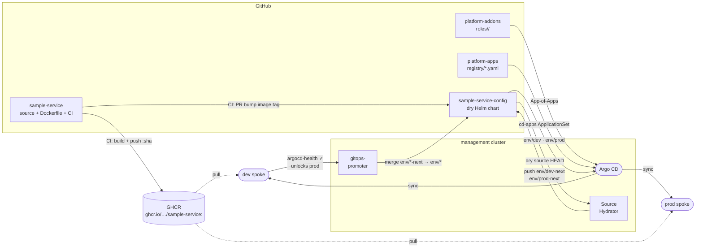

# CLAUDE.md

This file provides guidance to Claude Code (claude.ai/code) when working with code in this repository.

## Delivery pipeline

## Architecture

`platform-apps` is the business application registry. The `cd-apps` ApplicationSet (created by `platform-control-plane/scripts/bootstrap.sh`) reads `registry/*.yaml` and generates one Argo CD Application per (service × env).

- `registry/<service>.yaml` — declares the app: chart source, version, namespace, and environments array.
- `apps/<service>/` — Helm values files referenced by the ApplicationSet (`default-values.yaml`, `dev-values.yaml`, `prod-values.yaml`).

The ApplicationSet uses a matrix generator: git-file generator over `registry/*.yaml` × list generator expanding each file's `environments` array. Multi-source Helm: upstream chart + `ref: values` source pointing at this repo so value file paths resolve with `$values/`.

## Key conventions

- **Never use `destination.server`** — always `destination.name` (`dev` or `prod`).
- **Adding a new app**: push `registry/<svc>.yaml` + `apps/<svc>/` values — the ApplicationSet discovers it on next sync, no root manifests to update.
- **`$values` prefix** in `valueFiles` paths refers to the `ref: values` source; paths are relative to the repo root.
