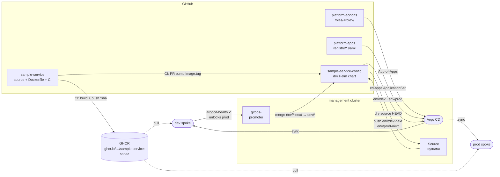

# platform-apps

Business application registry for the [platform-engineering-lab](https://github.com/platform-engineer-lab) hub-and-spoke Argo CD setup. Each app's Helm values live in its own dedicated config repo; this repo acts as the central discovery layer for three ApplicationSets.

Modelled after [marqeta/argo-cd-app-registry](https://github.com/marqeta/argo-cd-app-registry) with the following intentional differences:

- **Single git-file generator** instead of SCM Provider + region matrix — lab has two named spokes (`dev`, `prod`), no regions, no org of app repos to scan.
- **Destination by `name`** (`dev` / `prod`) instead of computed cluster names — stable across k3d restarts.
- **AppProject + ApplicationSets created imperatively by bootstrap** (consistent with the existing lab convention) rather than synced from a control repo.
- **Per-app config repos** — Helm values live in dedicated repos (e.g. `podinfo-config`) referenced via `valuesRepoURL`; this repo contains no `values/` or `apps/` directories.
- **Two delivery paths** — `registry/` for standard Helm apps (`cd-apps`) and `promoter/` for gitops-promoter pipeline apps (`cd-promoter-config`).

## Delivery pipeline



## How it works

```
platform-control-plane/scripts/bootstrap.sh
  ├── creates AppProject "business-apps"          (scoped: dev + prod destinations)
  ├── creates ApplicationSet "cd-apps"            (reads registry/*.yaml × envs)
  │         ↓  one multi-source Helm Application per (service × env)
  │     podinfo-dev   → destination.name: dev   ($values → podinfo-config repo)
  │     podinfo-prod  → destination.name: prod
  ├── creates ApplicationSet "cd-routes"          (reads routes/*/*)
  │         ↓  one HTTPRoute Application per (app × env)
  │     routes-podinfo-dev, routes-podinfo-prod, …
  └── creates ApplicationSet "cd-promoter-config" (reads promoter/*.yaml)
            ↓  one Application per promoter-enabled app → management cluster
        sample-service-promoter-config → sample-service-config/config/
```

### `cd-apps` — standard Helm delivery

Uses a **matrix of two generators**:

1. **Git file generator** — reads every `registry/*.yaml`; each file yields params including `valuesRepoURL`.
2. **List generator** — expands `.environments` into one element per env.

Multi-source Helm: upstream chart source + `ref: values` source pointing at the entry's `valuesRepoURL` (a dedicated per-app config repo) so `valueFiles` paths resolve with `$values/`.

### `cd-promoter-config` — gitops-promoter pipeline delivery

Uses a **git file generator** over `promoter/*.yaml`. Each entry generates one Argo CD Application that syncs `<configRepoURL>/<configPath>/` to the management cluster with `directory.recurse: true`, bringing the app's Argo CD Applications (`config/apps/`) and gitops-promoter CRs (`config/promoter/`) under GitOps control from the app's own config repo.

## Repository layout

```
registry/
  <service>.yaml    standard Helm app entry — consumed by cd-apps ApplicationSet

promoter/
  <service>.yaml    gitops-promoter app entry — consumed by cd-promoter-config ApplicationSet

routes/
  <app>/<env>/
    httproute.yaml  Envoy Gateway HTTPRoute — consumed by cd-routes ApplicationSet
```

Helm values live in **per-app config repos** (e.g. `podinfo-config`, `sample-service-config`) — not in this repo.

## Registry file schemas

**`registry/<service>.yaml`** — standard Helm app (`cd-apps`):
```yaml
name: <service>                          # used in Application name (<name>-<env>)
chartRepoURL: https://...                # Helm chart repository URL
chart: <chart-name>
chartVersion: <semver>                   # pin explicitly
namespace: <target-namespace>
valuesRepoURL: https://github.com/platform-engineer-lab/<service>-config
environments:
  - env: dev
    defaultValuesFile: $values/values/default-values.yaml
    envValuesFile: $values/values/dev-values.yaml
  - env: prod
    defaultValuesFile: $values/values/default-values.yaml
    envValuesFile: $values/values/prod-values.yaml
```

`$values` resolves to the `ref: values` source pointing at `valuesRepoURL` — paths are relative to that repo's root.

**`promoter/<service>.yaml`** — gitops-promoter app (`cd-promoter-config`):
```yaml
name: <service>
configRepoURL: https://github.com/platform-engineer-lab/<service>-config
configPath: config
```

## Adding a new application

**Standard Helm app:**
1. Create a `<service>-config` repo with `values/default-values.yaml`, `dev-values.yaml`, `prod-values.yaml`.
2. Create `registry/<service>.yaml` with `valuesRepoURL` pointing at that repo.
3. Add `<service>-config` to the `business-apps` AppProject `sourceRepos` in `platform-control-plane/scripts/bootstrap.sh`.
4. Push — `cd-apps` generates `<service>-dev` and `<service>-prod` on next sync.

**Gitops-promoter app:**
1. Create a `<service>-config` repo with `config/apps/` (Argo CD Applications) and `config/promoter/` (GitRepository, PromotionStrategy, ArgoCDCommitStatus).
2. Create `promoter/<service>.yaml` with `configRepoURL` pointing at that repo.
3. Push — `cd-promoter-config` generates `<service>-promoter-config` on next sync.

Verify: `kubectl --context k3d-management get applications -n argocd`.

## Env → cluster mapping

| `env` value in registry | Argo CD `destination.name` | k3d cluster |
|---|---|---|
| `dev`  | `dev`  | `k3d-dev`  |
| `prod` | `prod` | `k3d-prod` |
