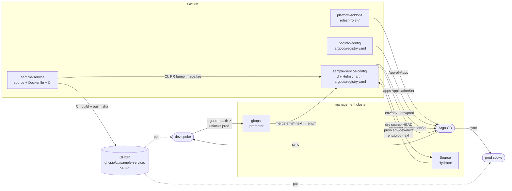

# platform-apps

Routes registry for the [platform-engineering-lab](https://github.com/platform-engineer-lab) hub-and-spoke Argo CD setup. App registration has moved to each app's own config repo — this repo now owns **routes only**.

## What changed

Previously this repo held central registry files (`registry/*.yaml`, `promoter/*.yaml`) that drove the `cd-apps` and `cd-promoter-config` ApplicationSets. Those files have been removed. Each app config repo now carries `.argocd/registry.yaml` as its own registration source of truth, following the [marqeta ADR-0011](https://github.com/platform-engineer-lab) SCM Provider self-registration convention.

## What lives here

```
routes/
  <app>/<env>/
    httproute.yaml   Envoy Gateway HTTPRoute — consumed by app-routes ApplicationSet
```

The `app-routes` ApplicationSet (in `platform-control-plane/scripts/bootstrap.sh`) uses a git directory generator over `routes/*/*` to generate one Argo CD Application per (app × env), syncing the HTTPRoute manifests to the appropriate spoke.

## App registration (no longer in this repo)

Each app config repo self-registers by shipping `.argocd/registry.yaml`. The `apps` and `promoter` ApplicationSets in bootstrap.sh read these files via static per-repo git generators declared in `HELM_APP_REPOS` and `PROMOTER_APP_REPOS` arrays.

**Helm app** (e.g. `podinfo-config/.argocd/registry.yaml`):
```yaml
name: podinfo
repoUrl: https://stefanprodan.github.io/podinfo
chart: podinfo
chartVersion: 6.14.0
namespace: podinfo
valuesRepoURL: https://github.com/platform-engineer-lab/podinfo-config
environment:
  - env: dev
    defaultValuesFile: values/default-values.yaml
    valuesFile: values/dev-values.yaml
  - env: prod
    defaultValuesFile: values/default-values.yaml
    valuesFile: values/prod-values.yaml
```

**Gitops-promoter app** (e.g. `sample-service-config/.argocd/registry.yaml`):
```yaml
name: sample-service
repoUrl: https://github.com/platform-engineer-lab/sample-service-config
configPath: config
```

## Adding a new route

Create `routes/<app>/<env>/httproute.yaml` with an Envoy Gateway `HTTPRoute` manifest. The `app-routes` ApplicationSet discovers it automatically on next sync — no bootstrap changes needed.

## Adding a new app

Routes belong here; registration belongs in the app's config repo. See [platform-control-plane README](https://github.com/platform-engineer-lab/platform-control-plane) for the full onboarding steps.

## Delivery pipeline


